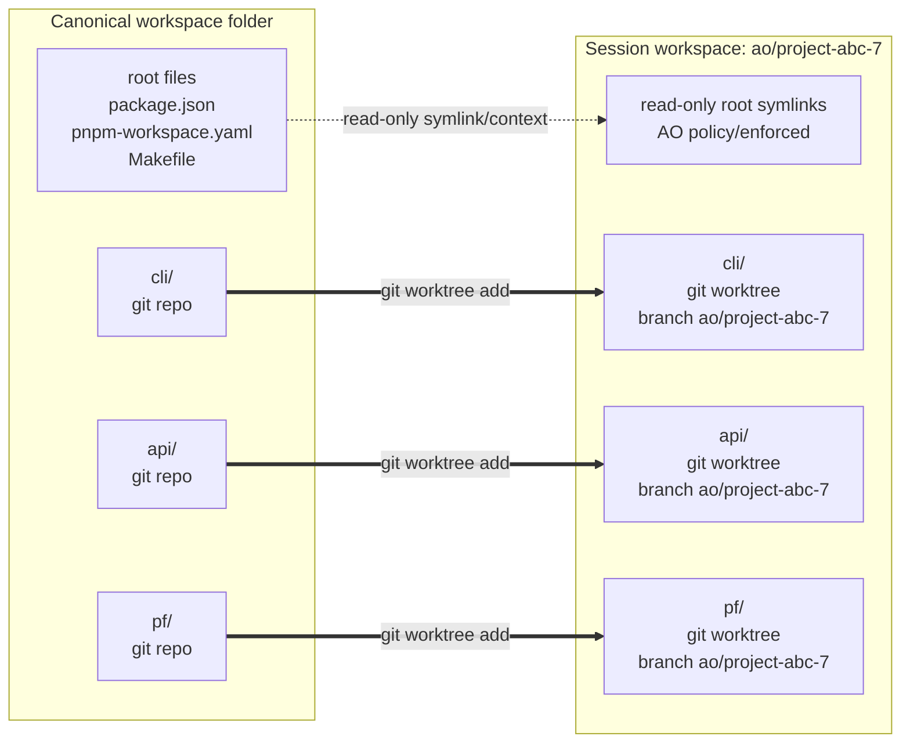
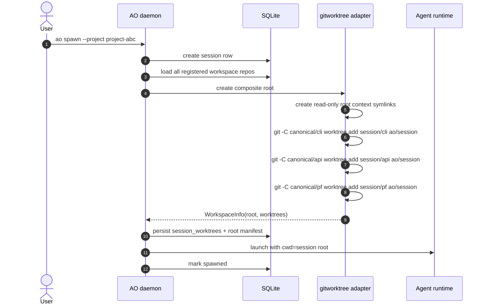
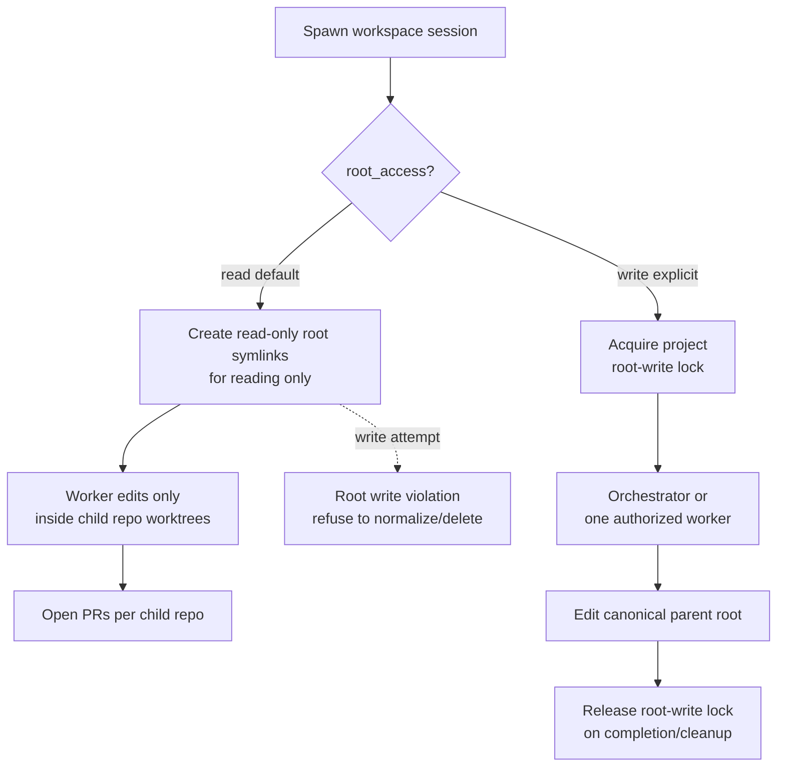
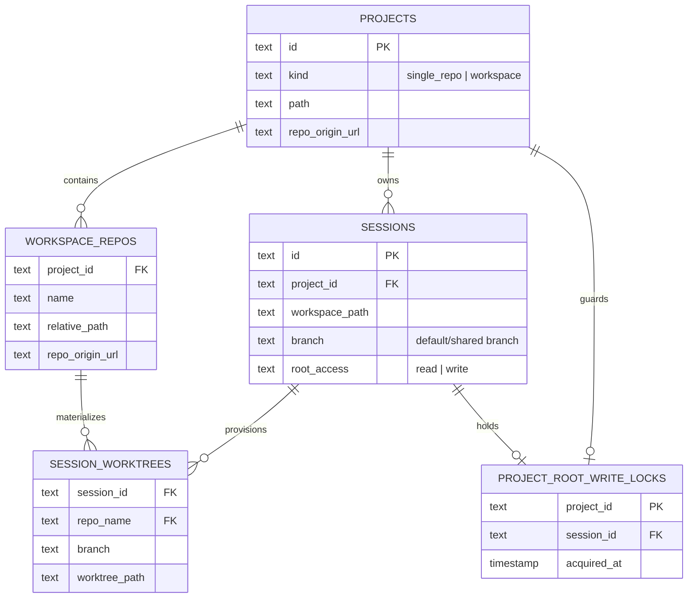

# Workspace projects: provisioning deep dive

This note turns the scoping discussion into an Option 1 implementation plan.
AO should support one logical project backed by multiple sibling git repositories
under a parent folder by composing native child git worktrees. The parent folder
may be plain/non-git; AO should not convert it into a submodule manifest repo as
the default path.

Submodules are documented only as a rejected alternative. They are viable for
teams that already want submodule semantics, but they should not be AO's
workspace implementation.

## Team presentation summary

The decision is: **AO composes a session workspace from native git worktrees of
every registered child repo.** The parent root is shared context. Normal workers
see root files through read-only symlinks, but they cannot own or edit those
files.



A workspace worker receives the root context plus **every registered child repo**.
There is no `--targets` subset in this model; each agent sees the whole
workspace shape.



Root files have a separate access model from child repo worktrees:



The durable model records every child worktree that AO provisions for a session:




## Current AO shape that constrains the design

AO currently assumes one registered project points at one git repository:

- `projects` stores one `path` and one `repo_origin_url`.
- `domain.ProjectRecord` mirrors that single-repo row.
- `ports.WorkspaceConfig` contains `ProjectID`, `SessionID`, and one `Branch`.
- `ports.WorkspaceInfo` returns one workspace `Path` and one `Branch`.
- `gitworktree.Workspace` resolves `ProjectID -> repo path`, then creates one
  managed worktree at `<managed-root>/<project>/<session>`.
- `domain.SessionMetadata` stores one `branch` and one `workspace_path`.
- `session_manager.Manager` calls `workspace.Create` once during spawn and
  `workspace.Destroy` once during kill/cleanup.
- The SCM observer can remain session-centric because PR ownership is already
  `PR -> session`; workspace support mainly changes how projects expose their
  repositories to the observer.

Workspace support therefore cannot be only a project-registration tweak. It
needs a workspace-aware project model and a workspace adapter response that can
represent one composite session root plus N child git worktrees.

## Terms

- **Single-repo project**: current project shape; `project.path` is a git repo.
- **Workspace project**: a project whose canonical path is a parent folder
  containing registered child git repositories.
- **Workspace repo**: one named child repository under a workspace project, such
  as `cli`, `api`, or `pf`.
- **Composite workspace**: the session root directory handed to the agent. For a
  workspace session it contains root context symlinks plus every registered
  workspace repo directory, each child directory being a real git checkout/worktree.

## Chosen provisioning model: composed child worktrees

Shape:

```txt
canonical/project-abc/          # may be plain, non-git parent
  package.json                  # root context file, not versioned by AO
  cli/                          # git repo
  api/                          # git repo

managed/project-abc/project-abc-7/
  package.json -> canonical/project-abc/package.json  # read-only root symlink
  cli/                          # git worktree of canonical cli
  api/                          # git worktree of canonical api
  pf/                           # git worktree of canonical pf
```

For every registered workspace repo, AO runs the equivalent of:

```bash
git -C <canonical>/<repo> worktree add <session-root>/<repo> <branch>
```

### Why this fits AO better

- It extends the existing `gitworktree` adapter instead of introducing a second
  source-control model.
- It preserves native git worktree behavior: shared object database, normal
  credentials/hooks/LFS/submodule behavior inside each child repo, and cheap
  provisioning.
- It keeps the parent folder non-invasive. AO does not write `.git/`,
  `.gitmodules`, or commits into the user's workspace root.
- Per-repo PRs stay natural. Each child repo has its own origin and branch, and
  the current `PR -> session` attribution still works.
- Cleanup remains worktree-based: remove each child worktree without `--force`,
  then prune. If one child repo refuses removal because it is dirty or locked, the
  composite cleanup is skipped/partial and retried later, matching AO's current
  safety posture.

### Costs and required AO changes

- AO, not git, owns the composition. The DB must record which child worktrees
  make up a composite workspace.
- The agent's cwd is a non-git parent containing child git repos. Agent adapters
  and prompts must not assume `WorkspacePath` itself is a git repo.
- Root files outside child repos are not protected by git. They need an explicit
  policy; otherwise cleanup can silently delete changes or concurrent sessions
  can overwrite each other.
- Branch operations are per child repo. The first cut should use one shared
  branch name across all child repos (`ao/<session-id>`), while storing the
  branch per child worktree so per-repo branch state remains explicit.
- If a user manually removes one child worktree, restore/destroy must detect a
  partially broken composite rather than treating the session as healthy.

### Root-file policy for first implementation

Root files in a non-git parent are **shared project context**, not
session-owned outputs. Normal worker sessions must not edit them.

Use root context links for normal sessions:

1. At workspace creation, symlink root-level files/directories that are not
   registered workspace repos and not `.git` into the composite root.
2. Establish those symlinks as read-only root context by AO policy: they make
   the workspace shape match the canonical parent and avoid a copy-back path.
3. Treat those links as read-only by AO policy: root paths are for context; all
   durable worker edits belong under child repo worktrees.
4. Do not copy root modifications back to canonical. With symlinks there is no
   copy-back path; an attempted write is either rejected by enforcement or is an
   immediate write to canonical and must be treated as a policy violation.
5. Store a root-context manifest so AO can detect missing/changed root entries
   during restore/cleanup and surface root write violations.

Important caveat: a symlink by itself is not a write barrier. If the agent runs
as the same OS user and the symlink points at a writable canonical file, a normal
editor can follow the link and mutate the canonical parent. AO therefore needs an
enforcement layer in addition to symlinks:

- spawn prompts and session instructions must explicitly forbid root edits for
  normal worker sessions;
- session tooling should treat writes outside child repo worktrees as a root
  write violation;
- cleanup/restore should detect root-context changes and refuse to silently
  discard or normalize them;
- stronger OS-level sandboxing can be added later, but the V1 contract should
  not pretend symlinks are sufficient isolation.

Root edits require an explicit **root-write session**:

- The orchestrator session may edit root files, or it may spawn/authorize one
  explicit worker session with root-write access.
- Root-write access is project-scoped and exclusive: at most one active
  root-write session per workspace project.
- Root-write sessions operate on the canonical parent root, not on per-session
  copies. There is no last-write-wins merge from worker workspaces.
- Normal workers can still have read-only root context links while a
  root-write session exists, but AO should warn that root context may change
  under them.
- If root files become a frequent code-change surface, the parent should be made
  a git repo or modeled as its own workspace repo so git owns concurrency,
  history, review, and rollback.

This keeps normal multi-repo worker sessions safe: they can read workspace-level
files like `package.json`, `pnpm-workspace.yaml`, `.env.example`, or `Makefile`,
but they cannot claim ownership of those files unless the orchestrator grants a
root-write session.

## Rejected default: parent repo with submodules

This is included only to explain why the team is not choosing it.

Shape:

```txt
canonical/project-abc/          # AO or user initializes this as a git repo
  .gitmodules
  package.json
  cli/                          # submodule gitlink
  api/                          # submodule gitlink

managed/project-abc/project-abc-7/
  package.json                  # versioned by parent
  cli/                          # initialized submodule checkout
  api/                          # initialized submodule checkout
```

Provisioning is roughly:

```bash
git -C <parent> worktree add <session-root> <parent-branch>
git -C <session-root> -c protocol.file.allow=always submodule update --init --recursive
```

### What it solves

- Root files become versioned in the parent repo, so the root-file conflict
  problem moves into git.
- The composite workspace is a single top-level git artifact.
- A parent commit can pin the exact child repo SHAs for reproducibility.

### Why it should not be the default

- It violates the already-discussed metadata direction: AO DB only, no AO-owned
  metadata in the parent folder. `.gitmodules` and gitlink commits become
  user-visible workspace metadata.
- It is invasive. Registering a plain folder would create `.git/`, `.gitmodules`,
  index entries, and commits in a directory the user did not necessarily intend
  to make a repo.
- It imposes submodule UX: detached HEADs after update, gitlink bumps whenever a
  child advances, and "submodule out of sync" states.
- Local sibling repositories require file-protocol allowances in common flows
  (`protocol.file.allow=always`). That is awkward to explain and easy to miss.
- It does not actually remove the need for child-repo metadata. If AO opens PRs
  against `cli` and `api`, the SCM observer still needs each child repo's origin,
  branch, and PR linkage.
- Session branch semantics split into parent branch and child branches. A single
  `sessions.branch` no longer describes the work.
- If AO opens only a parent PR with gitlink bumps, reviewers cannot review the
  child code changes in the usual repo PRs. If AO opens child PRs, parent
  gitlink bumps become extra bookkeeping.

Submodules are useful only when the team already wants a versioned workspace
manifest and accepts submodule workflows. AO can later support that as an
advanced registration mode or by treating an existing parent repo as a normal
single-repo project with submodules. It should not be the workspace
implementation.

## Schema direction

Prefer explicit tables over a JSON column because per-child worktree cleanup,
restore, and SCM observer enumeration are first-class operations.

Minimum durable additions:

```sql
ALTER TABLE projects ADD COLUMN kind TEXT NOT NULL DEFAULT 'single_repo'
  CHECK (kind IN ('single_repo', 'workspace'));

CREATE TABLE workspace_repos (
  project_id      TEXT NOT NULL REFERENCES projects(id) ON DELETE CASCADE,
  name            TEXT NOT NULL,
  relative_path   TEXT NOT NULL,
  repo_origin_url TEXT NOT NULL DEFAULT '',
  registered_at   TIMESTAMP NOT NULL,
  PRIMARY KEY (project_id, name),
  UNIQUE (project_id, relative_path)
);

CREATE TABLE session_worktrees (
  session_id    TEXT NOT NULL REFERENCES sessions(id) ON DELETE CASCADE,
  repo_name     TEXT NOT NULL,
  branch        TEXT NOT NULL,
  worktree_path TEXT NOT NULL,
  PRIMARY KEY (session_id, repo_name)
);
```

Keep `sessions.workspace_path` as the composite root handed to the runtime and
agent. Keep `sessions.branch` as the default/shared branch for compatibility,
but treat `session_worktrees.branch` as authoritative per child repo for
workspace projects.

Root access also needs durable state. Prefer explicit tables/columns such as:

```sql
ALTER TABLE sessions ADD COLUMN root_access TEXT NOT NULL DEFAULT 'read'
  CHECK (root_access IN ('read', 'write'));

CREATE TABLE project_root_write_locks (
  project_id  TEXT PRIMARY KEY REFERENCES projects(id) ON DELETE CASCADE,
  session_id  TEXT NOT NULL REFERENCES sessions(id) ON DELETE CASCADE,
  acquired_at TIMESTAMP NOT NULL
);
```

If root context manifests are stored durably, add either a separate
`session_root_files` table or a metadata blob dedicated to cleanup safety. Do
not overload display status or activity state with root-file dirtiness.

## Port and adapter changes

Likely port changes:

```go
type WorkspaceConfig struct {
    ProjectID  domain.ProjectID
    SessionID  domain.SessionID
    Branch     string
    RootAccess string // "read" for normal workers, "write" only when orchestrator-authorized
}

type WorkspaceInfo struct {
    Path      string // composite root
    Branch    string // default/shared branch
    SessionID domain.SessionID
    ProjectID domain.ProjectID
    Worktrees []WorkspaceWorktreeInfo
}

type WorkspaceWorktreeInfo struct {
    Name string
    Path string
    Branch string
}
```

`gitworktree.RepoResolver` should become a project/workspace resolver that can
return either:

- one single-repo path for `single_repo`, or
- a workspace root plus named child repos for `workspace`.

For single-repo projects, the adapter keeps today's exact behavior. For
workspace projects, it creates the composite root, links root context entries,
then creates one child worktree for every registered workspace repo.

## Registration behavior

- `ao project add --path <git-repo>` remains the current single-repo flow.
- `ao project add --path <plain-folder>` without `--as-workspace` should return
  a typed error that includes detected child repos. The UI can use that to show
  the interactive "register whole folder or pick one" prompt.
- `ao project add --path <plain-folder> --as-workspace` registers a workspace
  project with every detected child git repo.
- A folder with no child git repos remains invalid and should suggest `git init`.
- Non-git child folders are skipped by the first CLI implementation. Offering
  to `git init` them is a UI flow or a later explicit CLI flag; the daemon should
  not mutate child folders implicitly.

## Spawn behavior

- Do not add `--targets`. Workspace sessions always provision all registered
  workspace repos.
- For single-repo projects, spawn behavior remains unchanged.
- For workspace projects, AO loads the registered workspace repo list and creates
  one child worktree for each repo.
- Normal worker sessions get `root_access=read`: they can read root context
  links but must not edit root files.
- Add an orchestrator-only way to request `root_access=write` for the
  orchestrator itself or for one explicit worker. The request must acquire the
  project root-write lock before launch.
- Use one shared branch name by default: `ao/<session-id>` in every child repo.
  Store per-child worktree rows anyway.

## Cleanup and restore

Create/restore/destroy must be all-child-repo aware:

- `Create`: create composite root, link root context, then create each child
  worktree. If child N fails, remove already-created child worktrees and leave
  no registered half-session when possible.
- `Restore`: verify every child worktree still exists and is registered. If one
  is missing but its directory is empty, recreate it. If a path exists and is not
  the registered worktree, refuse restore.
- `Destroy`: call `git worktree remove` for every child repo without `--force`,
  prune each child repo, release any root-write lock, and only remove the composite
  root when every child removal succeeds and root context policy checks pass.
- `Cleanup`: if one child repo refuses removal, preserve the composite root and
  report/skip the session for retry. Do not delete root files or sibling
  worktrees just because some child worktrees cleaned up successfully.

## Implementation slices

1. **Project model and detection**
   - Add `projects.kind` and `workspace_repos`.
   - Detect direct child git repos during `project.Add`.
   - Add `--as-workspace` to CLI/API input.
   - Return workspace repo names in project get/list details.

2. **Session worktree schema**
   - Add `session_worktrees` and store methods.
   - Record one row for every child repo materialized into the session.
   - Use those rows for restore, cleanup, and per-repo SCM enumeration.

3. **Composite workspace adapter**
   - Extend `gitworktree.Workspace` to branch on project kind.
   - Reuse existing single-repo create/restore/destroy code for each child.
   - Add integration tests for two sibling repos, partial cleanup refusal, and
     restore after one child worktree is manually removed.

4. **Root context safety**
   - Link root context entries into normal session roots.
   - Record a root context manifest.
   - Add root-write access state and an exclusive project root-write lock.
   - Refuse cleanup/restore paths that would hide root write violations.
   - Document that routine root edits require a root-write session, and frequent
     root edits should make the parent a git repo or separate workspace repo.

5. **SCM observer enumeration**
   - Read workspace child origins from `workspace_repos`.
   - Preserve PR-to-session attribution. No per-subrepo activity source is
     needed.

## Decision checkpoint

Before coding past slice 1, confirm these remaining product decisions:

1. Root-write authorization UX: which exact command/agent path lets the
   orchestrator grant `root_access=write` to itself or one explicit worker?
2. Branch naming: one shared `ao/<session-id>` branch in every child repo for V1?

The provisioning decision is settled: implement composed child worktrees for
every registered child repo. The root-file decision is also settled: normal
sessions get read-only root symlinks; root edits require an explicit
orchestrator-authorized root-write session.
